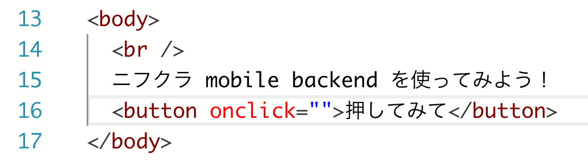
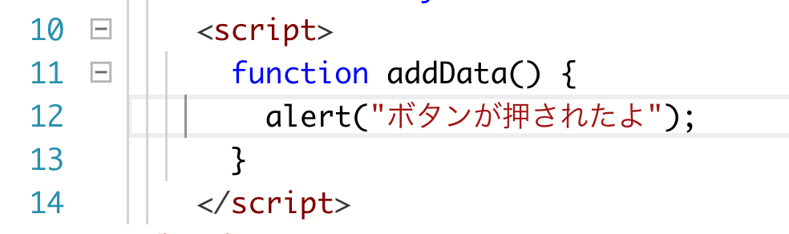

name: inverse
layout: true
class: center, middle, inverse
---
# Monaca で　　　　　 mobile backend 　　　を使ってみよう
富士通クラウドテクノロジーズ株式会社

.right[]

.footnote[
20190628
]

---
layout: true
class: center, middle, inverse_sub
---
## はじめに

.right[]

---
layout: false
### 概要

とりあえず mobile backend を使ってみましょう。 そして、何ができるか実際に触って理解しましょう。

* 今日だけでも「データストア」を結構理解できます :+1:

#### 資料
https://natsumo.github.io/StartNCMB_WithMonaca

---
### アジェンダ

1. mobile backend って何？
1. mobile backend を手っ取り早く使うには
1. 実際に触ってみましょう①
  1. Monaca の準備
  1. Monaca の練習
  1. mobile backend の準備
  1. mobile backend と Monaca を連携する
  1. mobile backend にデータを保存する
1. 実際に触ってみましょう②
  1. hogehoge準備中

---
layout: true
class: center, middle, inverse_sub
---
## 1. mobile backend って何？

---
layout: false
### 1. mobile backend って何？

私たちが提供するサービス [ニフクラ mobile backend](https://mbaas.nifcloud.com/) とは何か？ 
一言で言うなれば「 **構築不要ですぐに使えるクラウドデータベース** 」

.center[

]

アプリに欲しい機能は大体用意されているので、使えさえすればこっちのもの。 
使うために必要なことは .font_color_remark[**使い方を覚える**] これだけ。

---
layout: true
class: center, middle, inverse_sub
---
## 2. mobile backend を手っ取り早く使うには

---
layout: false
### 2. mobile backend を手っ取り早く使うには

開発中のアプリがあればそれに組み込むのが一番。 （AndroidでもiOSでもUnityでも）

開発中のアプリが特に無くて、 
とりあえず使い勝手を試したいのであれば [Monaca](https://ja.monaca.io/) を使うと良い :ok_hand:

.center[

]

* 連携が断然楽
* 環境構築不要（ブラウザで開発）
* みんな知ってるJavaScript

などなど、簡単に使えるので。

今回はこの [Monaca](https://ja.monaca.io/) を使って mobile backend の使い方を習得していきましょう。

---
layout: true
class: center, middle, inverse_sub
---
## 3. 実際に触ってみましょう①

---
layout: false
### 3. 実際に触ってみましょう①

1. Monaca の準備
1. Monaca の練習
1. mobile backend の準備
1. mobile backend と Monaca を連携する
1. mobile backend にデータを保存する

---
#### 1. Monaca の準備

利用環境を準備する。

* ブラウザ
  * <a href='https://www.google.com/chrome/' target='_blank'>Chrome</a>以外では動きません
* アカウント
  * <a href='https://monaca.mobi/ja/signup' target='_blank'>Monaca 利用登録（無料）</a>
* デバッガー【任意】
  * <a href='https://ja.monaca.io/debugger.html' target='_blank'>Monacaデバッガー</a>

__ ★後で消す

.right_under[
.size_small_7[
.font_color_ncmb_blue[
3.実際に触ってみましょう①
]
]
]

---
#### 1. Monaca の準備

Monaca にログインする。

.center[]

https://ja.monaca.io/

.right_under[
.size_small_7[
.font_color_ncmb_blue[
3.実際に触ってみましょう①
]
]
]

---
#### 1. Monaca の準備

Monaca プロジェクトを作る。

.center[]

「最小限のテンプレート」を選びます。

.center[]

.right_under[
.size_small_7[
.font_color_ncmb_blue[
3.実際に触ってみましょう①
]
]
]

---
#### 1. Monaca の準備

プロジェクト名はこのままでOKです。「作成」をクリックします。

.center[]

.right_under[
.size_small_7[
.font_color_ncmb_blue[
3.実際に触ってみましょう①
]
]
]

---
#### 1. Monaca の準備

プロジェクトが作成されます。

.center[]

選択すると、右側に表示される「クラウドIDEで開く」をクリックします。

.center[]

.right_under[
.size_small_7[
.font_color_ncmb_blue[
3.実際に触ってみましょう①
]
]
]

---
#### 1. Monaca の準備

プロジェクトが開かれます。

.center[]

.right_under[
.size_small_7[
.font_color_ncmb_blue[
3.実際に触ってみましょう①
]
]
]

---
#### 2. Monaca の練習

`index.html` が表示されています。 `body` タグ内を少し編集してみましょう。

.center[]

.right_under[
.size_small_7[
.font_color_ncmb_blue[
3.実際に触ってみましょう①
]
]
]

---
#### 2. Monaca の練習

一度消して、何か書いてみましょう。

.center[]

書けたら保存します。 
「ファイル」＞「保存」または「Ctrl + s」（Macは「command + s」）でプロジェクトを保存します。

.right_under[
.size_small_7[
.font_color_ncmb_blue[
3.実際に触ってみましょう①
]
]
]

---
#### 2. Monaca の練習

保存すると、右側プレビュー画面が更新され `body` タグ内に書いた文字が表示されます。

.center[]

.right_under[
.size_small_7[
.font_color_ncmb_blue[
3.実際に触ってみましょう①
]
]
]

---
#### 2. Monaca の練習

それではいよいよ本題に向けた練習に入ります。 
**mobile backend にデータが保存されるボタン** を作ってみましょう。

さっき書き換えた文字の下に `button` タグを用意します。

.center[]

保存してプレビュー画面で確認しましょう。

.right_under[
.size_small_7[
.font_color_ncmb_blue[
3.実際に触ってみましょう①
]
]
]

---
#### 2. Monaca の練習

ボタンにクリックイベントを追加しましょう。

.center[]

  

**mobile backend にデータを保存する処理** を書く `function` 名を「 `addData()` 」としましょう。

.center[]

.right_under[
.size_small_7[
.font_color_ncmb_blue[
3.実際に触ってみましょう①
]
]
]

---
#### 2. Monaca の練習

**mobile backend にデータを保存する処理** を書く `function` 「 `addData()` 」を用意しましょう。JavaScriptなので、`script` タグ内に記述します。

.center[]

 

一応動作確認をしておきましょう。 一旦 `alert` を表示する `function` にしましょう。

.center[]

.right_under[
.size_small_7[
.font_color_ncmb_blue[
3.実際に触ってみましょう①
]
]
]

---
#### 2. Monaca の練習

保存してからプレビュー画面でボタンを押してみましょう。 
ブラウザの `alert` が表示されればOKです。

.center[]

`alert` を消して保存しておきましょう。

.right_under[
.size_small_7[
.font_color_ncmb_blue[
3.実際に触ってみましょう①
]
]
]

---
#### 3. mobile backend の準備

いよいよ **mobile backend にデータを保存する処理** を実装していきます。 
図の１〜３の手順で実装していきます。

.center[]

.right_under[
.size_small_7[
.font_color_ncmb_blue[
3.実際に触ってみましょう①
]
]
]

---
#### 3. mobile backend の準備

.right_under[
.size_small_7[
.font_color_ncmb_blue[
3.実際に触ってみましょう①
]
]
]

---
#### 3. mobile backend の準備

.right_under[
.size_small_7[
.font_color_ncmb_blue[
3.実際に触ってみましょう①
]
]
]

---
#### 3. mobile backend の準備

.right_under[
.size_small_7[
.font_color_ncmb_blue[
3.実際に触ってみましょう①
]
]
]

---
#### 3. mobile backend の準備

.right_under[
.size_small_7[
.font_color_ncmb_blue[
3.実際に触ってみましょう①
]
]
]

---
#### 4. mobile backend と Monaca を連携する

.right_under[
.size_small_7[
.font_color_ncmb_blue[
3.実際に触ってみましょう①
]
]
]

---
#### 5. mobile backend にデータを保存する

.right_under[
.size_small_7[
.font_color_ncmb_blue[
3.実際に触ってみましょう①
]
]
]

---
layout: true
class: center, middle, inverse_sub
---
## まとめ

---
layout: false

### まとめ

おしまい
